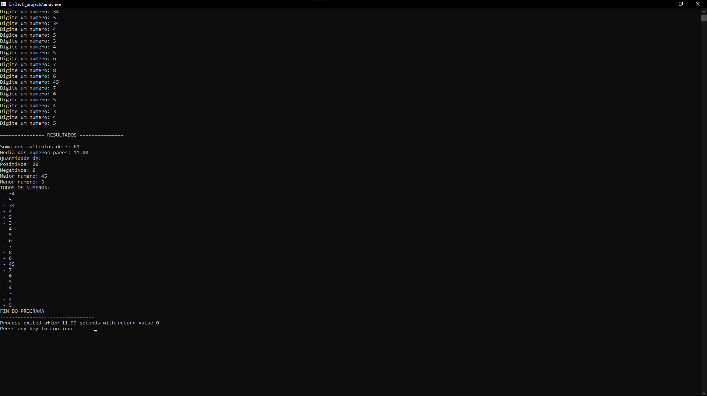

# Atividade — Vetores em C

## 👨‍🎓 Identificação

**Aluno:** Zamorano Sousa
**Disciplina:** Programação em C
**Instituição:** UDF — Centro Universitário
**Atividade:** Manipulação de Vetores em C

---

## 📌 Objetivo

Desenvolver um programa em linguagem C para aplicar conceitos de **arrays (vetores)**, estruturas de repetição, estruturas condicionais, entrada de dados e operações matemáticas.

O programa recebe 20 números inteiros informados pelo usuário, armazena os valores em um vetor e realiza diferentes operações sobre os elementos armazenados.

---

## ⚙️ Funcionalidades

O programa realiza as seguintes operações:

* Lê 20 números inteiros;
* Armazena os números em um vetor de 20 posições;
* Calcula a soma dos números múltiplos de 3;
* Calcula a média dos números pares;
* Conta a quantidade de números positivos;
* Conta a quantidade de números negativos;
* Identifica o maior número armazenado;
* Identifica o menor número armazenado;
* Exibe todos os números armazenados no vetor.

O programa também trata o caso em que **não existem números pares**, evitando uma divisão por zero.

O valor `0` não é contabilizado como positivo ou negativo.

---

## 🧠 Lógica utilizada

Primeiramente, é declarado um vetor com 20 posições:

```c
int lista_numeros[20];
```

Um laço de repetição `for` é utilizado para solicitar os 20 números ao usuário e armazená-los no vetor.

Durante o preenchimento do vetor, são realizadas algumas verificações:

### Múltiplos de 3

O operador `%` é utilizado para verificar se o resto da divisão do número por 3 é igual a zero.

```c
if ((lista_numeros[i] % 3) == 0)
```

Quando a condição é verdadeira, o número é adicionado à soma dos múltiplos de 3.

### Números pares

Também é utilizado o operador `%` para verificar se o número é divisível por 2.

```c
if ((lista_numeros[i] % 2) == 0)
```

Os números pares são somados e a quantidade de números pares é contabilizada. Ao final, a média é calculada somente quando existe pelo menos um número par, evitando divisão por zero.

### Números positivos e negativos

Os valores são classificados por meio de estruturas condicionais:

* Valores maiores que zero são considerados positivos;
* Valores menores que zero são considerados negativos;
* O valor zero não é contabilizado em nenhuma das duas categorias.

### Maior e menor valor

Após o preenchimento do vetor, o primeiro elemento é utilizado inicialmente como referência para o maior e o menor valor.

Em seguida, os demais elementos são percorridos e comparados com essas referências para encontrar os valores máximo e mínimo.

### Exibição dos elementos

Por fim, outro laço `for` percorre o vetor e apresenta todos os 20 números armazenados.

---

## 🛠️ Tecnologias utilizadas

* **Linguagem:** C
* **Biblioteca:** `stdio.h`
* **Estrutura de dados:** Array (vetor)
* **Compilador:** GCC

---

## ▶️ Como compilar e executar

### 1. Clone o repositório

```bash
git clone URL_DO_SEU_REPOSITORIO
```

### 2. Acesse a pasta do projeto

```bash
cd nome-do-repositorio
```

### 3. Compile o programa

Utilizando o GCC:

```bash
gcc nome_do_arquivo.c -o programa
```

### 4. Execute o programa

No Windows:

```bash
programa.exe
```

No Linux:

```bash
./programa
```

---

## 💻 Exemplo de execução

### Entrada

Exemplo de valores informados pelo usuário:

```text
1
2
3
4
5
6
7
8
9
10
11
12
13
14
15
16
17
18
19
20
```

### Saída esperada

```text
=============== RESULTADOS ===============

Soma dos multiplos de 3: 63
Media dos numeros pares: 11.00
Quantidade de:
Positivos: 20
Negativos: 0
Maior numero: 20
Menor numero: 1

TODOS OS NUMEROS:
 - 1
 - 2
 - 3
 - 4
 - 5
 - 6
 - 7
 - 8
 - 9
 - 10
 - 11
 - 12
 - 13
 - 14
 - 15
 - 16
 - 17
 - 18
 - 19
 - 20

FIM DO PROGRAMA
```

> **Observação:** a saída acima é apenas um exemplo de execução. Os resultados serão diferentes de acordo com os números informados pelo usuário.

---

## 📸 Evidência de execução

Abaixo deve ser adicionada uma captura de tela comprovando a execução do programa.

**Exemplo de organização do arquivo:**

```text
evidencias/
└── execucao.png
```

A imagem deve mostrar a execução do programa e os resultados apresentados no terminal.



---

## 📁 Estrutura do repositório

```text
array-em-C/
│
├── array.c
├── README.md
│
└── evidencias/
    └── execucao.png
```

---

## 📚 Conceitos praticados

Nesta atividade foram praticados os seguintes conceitos:

* Variáveis;
* Tipos de dados;
* Arrays (vetores);
* Estruturas `for`;
* Estruturas `if` e `else if`;
* Operadores aritméticos;
* Operador de módulo `%`;
* Entrada de dados com `scanf`;
* Saída de dados com `printf`;
* Contadores e acumuladores;
* Cálculo de média;
* Comparação de valores;
* Organização e documentação de código em C.
